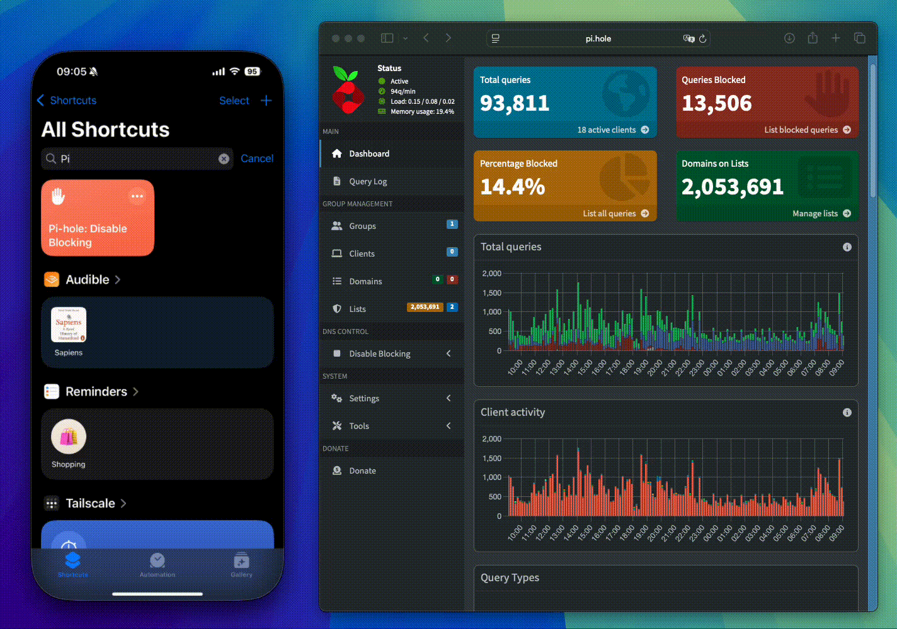
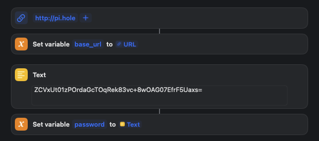

> [!IMPORTANT]  
> This shortcut is for Pi-hole v6+; it will not work on older versions. Learn about the 5 → 6 upgrade path [here](https://docs.pi-hole.net/docker/upgrading/v5-v6/). 

# Pi-hole:  Shortcut to Disable Blocking 

An Apple Shortcut to disable blocking on a Pi-hole instance.

## Installation

 - Navigate to the latest [release](https://github.com/mc7h/shortcut-pihole-disable-blocking/releases).
 - Download the Shortcut via the iCloud link.
 - Follow the on-screen prompts and select **Get Shortcut** to install the Shortcut onto your device.
 - On the Pi-hole web UI, under **Settings > Web interface / API**, toggle to **expert** mode and **Configure app password**.
 - **Edit** the Shortcut and update the `password` and (if required) `base_url` variables for your Pi-hole instance.

 

> [!NOTE]  
> The `password` in the Shortcut is long since rotated. It wasn't accidentally leaked *!*

## Contributing

Any and all feedback, feature requests, and issues are *most* welcome.

If you find this project helpful, you can ☕️ [buy me a coffee](https://ko-fi.com/E1E01E15RC) to support its development.